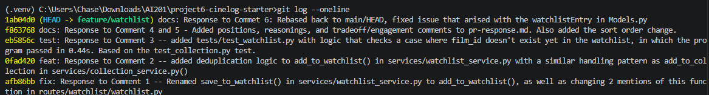

# PR Response Doc — CineLog Watchlist Feature

## AI Usage

Usage 1 - for Comment 3, I asked Claude Code to review my test_watchlist.py fixes and review it before running them, to catch mistakes before spending a test run on them.
Usage 2 - I used Claude Code as a devil's advocate by giving me tradeoffs to my choices in my Comment 4 and Comment 5 responses, working from positions I'd already decided on. Claude here returned a paragraph tradeoff, in which I compared to my initial decisions and formed the tradeoff entries with Claude's tradeoffs and it's effects on my thinking versus what I chose in the end.
Usage 3 - when Comment 6's rebase silently dropped the WatchlistEntry class from models.py, with no conflict marker, I used Claude code to diagnose why pytest was failing with an ImportError and to confirm, by diffing the pre- and post-rebase versions of models.py, exactly what the rebase had silently removed.

## Comment 1 — Rename

**What I did:** What I did was I renamed save_to_watchlist() to add_to_watchlist() in services/watchlist_service.py, as well as changing two mentions of the original save_to_watchlist() function in routes/watchlist/watchlist.py
**How I verified:** I verified by using my code editors search to find all the references of "save_to_watchlist" to make sure I didn't miss any mentions of it.

## Comment 2 — Deduplication

**What I did:** I edited add_to_watchlist() in services/watchlist_service.py by adding an "existing" boolean value that was a WatchlistEntry query that is filtered by userid and filmid. I then used an if statement to check if "existing" is true, and if it was it would call a AlreadyInWatchlistError, in which I supplementarily created as a class on top of add_to_watchlist().
**How I verified:** How I verified is I went to services/collection_service.py and checked out it's add_to_collection() and say the differences inbetween it and add_to_watchlist()'s program, and noticed a block of code that mentioned above, everything else looked identical logically. I reran through the deduplication logic of both functions and now both line up.

## Comment 3 — Missing test

**What I did:** I made a new test file test_watchlist.py with the same test logic as test_add_to_collection_nonexistent_film_raises in test_collection.py but specific to test_watchlist. I had to change the name of the function and the add_to call. I also needed to add the correct imports, and make the same three pytest.fixture apps, which was copied from test_collection.py but to instead fix testing the watchlist instead.
**How I verified:** I verified by asking Claude if my test logic made sense and to point out anything that needed to be fixed. Afterwards, I ran "pytest tests/test_watchlist.py -v" on a film_id that doesnt exist to make sure that it passes, in which case it did within 0.44s.

## Comment 4 — Default visibility

**My position:** Keep public=True as the default.
**Reasoning:** The model already supports per-entry visibility, which only matters if there's a profile page or activity feed consuming it. That feature only works if entries are visible by default. Privacy toggles are low-engagement UI: if we shipped public=False, the majority of users would never find or flip the setting, and the social pages and feeds would silently stay empty, thus the feature would behave like a private list even though we built it to be shared. I'm optimizing for the common case of adding movies to watch which most people don't treat as sensitive, and for the bootstrapping a social watchlist feed feature actually doing what it was built for instead of dying from an opt-in.
**Tradeoff acknowledged:** The real cost is potentially violating user consent. A user adding a film to their watchlist is doing a tracking action, not making a privacy decision, and defaulting to public means some entries get shared before the user has consciously chosen that. An opt-in (public=False) default avoids this entirely and better matches "privacy by default" norms, at the cost of a colder emptier experience early on. Given that tradeoff, I think public=True is the right call if it's paired with a clear, discoverable way to opt out, such a toggle during oboarding, so the default is a starting point users can consciously reject rather than a silent decision made for them.

## Comment 5 — Sort order

**My position:** Agreed. I changed get_watchlist() in services/watchlist_service.py to order by WatchlistEntry.date_added.desc() instead of Film.title.asc().
**Reasoning:** A watchlist is a queue of intent, not a reference catalog. Users add a film because they want to watch it soon, and the entries at the top of that queue should be the ones they most recently decided mattered. Alphabetical order is a lookup pattern, useful when you already know what you're searching for, but it buries the thing a user just added under whatever else happens to start with an earlier letter.
**Engagement with reviewer's point:** don't have a strong counter-argument here, the reviewer's read on user intent matches how I'd actually use this feature myself. The one thing I'd add is that this decision should stay scoped to the watchlist. A user's completed collection is closer to a catalog people browse and revisit, so alphabetical order there still seems like the right default and shouldn't get swept into this change.

## Comment 6 — Rebase

**What conflicted:** Running: pytest tests/test_watchlist.py -v causes an ImportError while importing test module form the test_watchlist.py. There is an issue importing WatchListEntry from Models.
**How I resolved it:** I resolved this issue by going to Models.py, copying and pasting class CollectionEntry(db.Model), and rewriting it to be class WatchlistEntry(db.model), making sure the table arguments called from unique_user_film_watchlist as well.
**How I verified no conflict remains:** How I verified that there was no issues was by first fully going through the new function to make sure that there was nothing carried over from the collections function. Next, I reran pytest tests/test_watchlist.py -v, which passed now. I also ran pytest tests/ -v to make sure everything as whole passed as well.



## PR Description

Adds a **watchlist** to CineLog: a list of films a user wants to watch, separate from their CollectionEntry list of films they've already watched. This adds a WatchlistEntry model plus two endpoints:

| Method | Endpoint                 | Description                                               |
| ------ | ------------------------ | --------------------------------------------------------- |
| GET    | /watchlist/<user_id>     | Get a user's watchlist, most recently added first         |
| POST   | /watchlist/<user_id>/add | Add a film to the watchlist (body: {"film_id": "<uuid>"}) |

Adding a film that's already on the user's watchlist, or a film_id that doesn't exist, is rejected at the service layer (AlreadyInWatchlistError / FilmNotFoundError in services/watchlist_service.py) rather than silently creating a duplicate row or an orphaned entry.

### Design decisions

- **Default visibility (public=True):** New entries default to public so the social/discovery use case (profile pages, activity feeds showing what friends want to watch) works out of the box, instead of silently staying empty behind a privacy toggle most users would never find. Full reasoning and the acknowledged privacy tradeoff are in Comment 4 above.
- **Sort order (date added, descending):** The watchlist is ordered by date_added descending rather than alphabetically, since it's a queue of recent intent a user actively works through, not a catalog to browse by name. Full reasoning is in Comment 5 above.

### Manual testing steps

1. Start the app: python app.py (runs on `http://localhost:5000`).
2. Grab a real user_id and film_id from the seeded database:
   ```bash
   python -c "from app import create_app; from models import User, Film
   app = create_app()
   with app.app_context():
       print('user_id:', User.query.first().id)
       print('film_id:', Film.query.first().id)"
   ```
3. Add that film to the user's watchlist and confirm a 201 with public: true in the response body:
   ```bash
   curl -X POST http://localhost:5000/watchlist/<user_id>/add \
     -H "Content-Type: application/json" \
     -d '{"film_id": "<film_id>"}'
   ```
4. Fetch the watchlist and confirm the film you just added is present:
   ```bash
   curl http://localhost:5000/watchlist/<user_id>
   ```
5. Add a second, different film to the same watchlist, then re-run step 4 and confirm the second film now appears **before** the first — this verifies the date-added-descending sort order.
6. Repeat step 3 with the same film_id again.
7. Repeat step 3 with a made-up film_id (e.g. "00000000-0000-0000-0000-000000000000").
8. Run the automated suite: pytest tests/ -v and confirm all tests pass.
